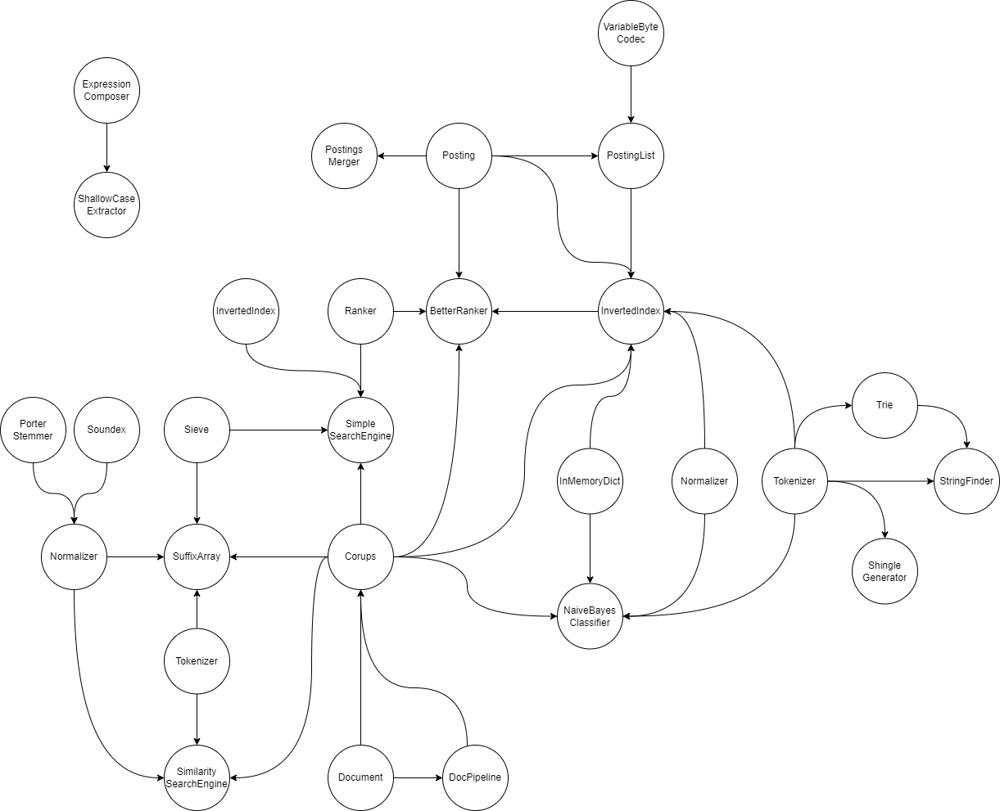
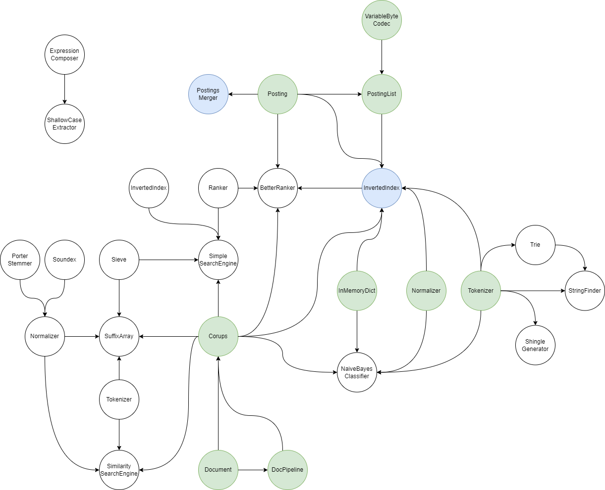
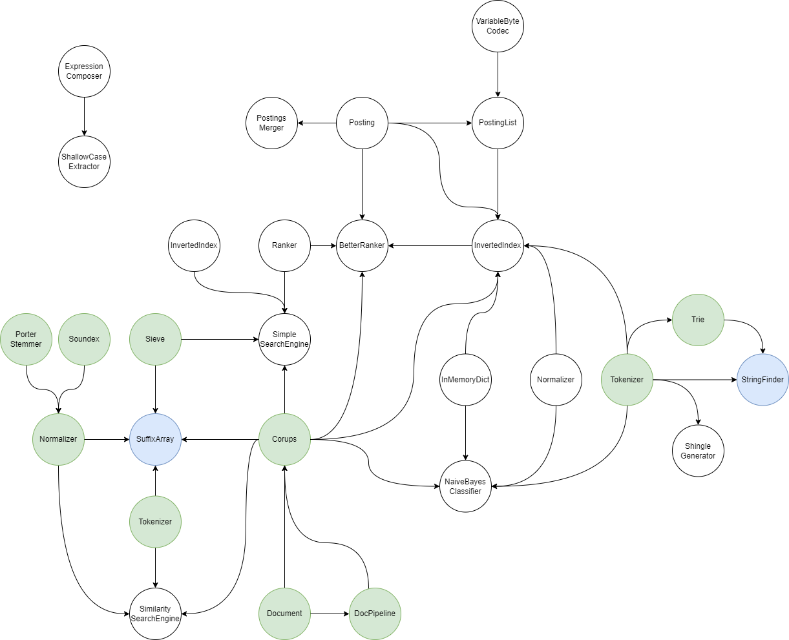
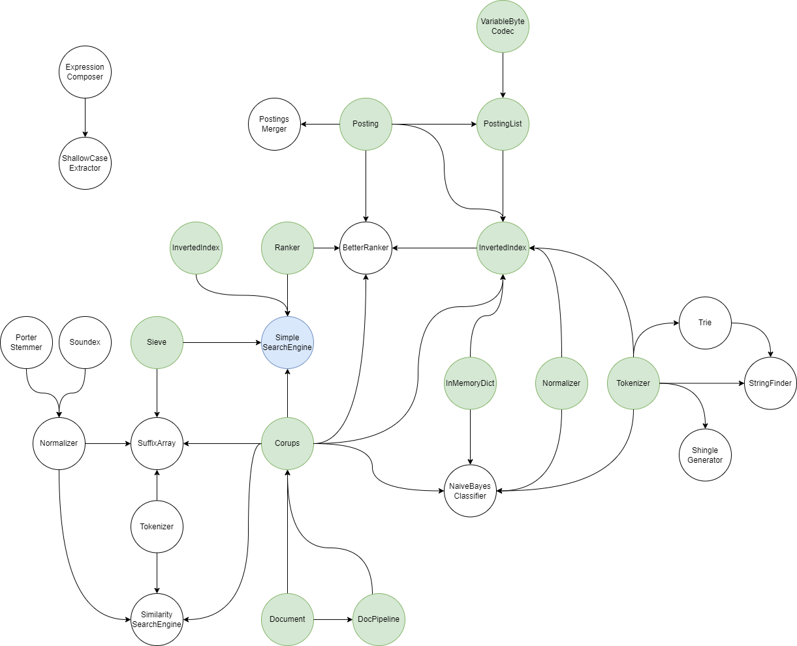

# Prekoden

For å løse obligene, er dere forventet å endre noen utvalgte filer i [repoet](https://github.com/aohrn/in3120-2023/tree/main/in3120). Her er det mye kode, og det kan virke skummelt ved første øyekast. Dere skal derimot ikke endre mange filer per innlevering, ofte bare én eller to. Det er heller ikke særlig mye kode som skal skrives, da målet heller er å skrive "riktig" kode :)

Etter hver innlevering kan/bør man kjøre `git pull`, da foreleser vil publisere løsningsforslaget (integrert i repoet). Dermed vil du alltid ha et så godt som mulig utgangspunkt før hver innlevering, og vil ikke ha et dårligere utgangspunkt for f.eks. [Assignment B](https://github.com/aohrn/in3120-2023/blob/main/assignment-b.md) om du leverte en halv-perfekt [Assignment A](https://github.com/aohrn/in3120-2023/blob/main/assignment-a.md).

Obligene går, i korte trekk, ut på å implementere ferdig et påbegynt søkesystem. Det er en del avhengigheter blant filene, som for eksempel at InMemoryInvertedIndex benytter PostingList.

Grafen under er et forsøk på å vise avhengighetene mellom filene i in3120-mappen.

Ofte vil det holde å jobbe i filen man skal endre, og støtte seg på pensum. Andre ganger kan det være nyttig å prøve å forstå sammenhengene mellom avhengighetene. Hvorfor er for eksempel PostingsMerger avhengig av Posting? Kan det hjelpe å forstå hva som skjer i Posting før man implementerer ferdig TODOene i PostingsMerger?

For å løse Assignment A skal dere bare endre `invertedindex.py` og `postingsmerger.py`, markert i blå. De avhenger på en eller annen måte av alle filene markert i grønn:

Det er altså snakk om 2 filer dere skal endre, samt 9 filer som ikke skal endres, men som er direkte (eller indirekte) nødvendige for at testene passerer. Dermed kan dere fint ignorere de resterende 17 filene for nå.

I Assignment B skal dere bare endre `suffixarray.py` og `stringfinder.py`, og da er det disse som er direkte relevante:

For [Assignment C](https://github.com/aohrn/in3120-2023/blob/main/assignment-c.md) er det bare `simplesearchengine.py` som skal endres, og den har følgende avhengigheter:

Osv.
