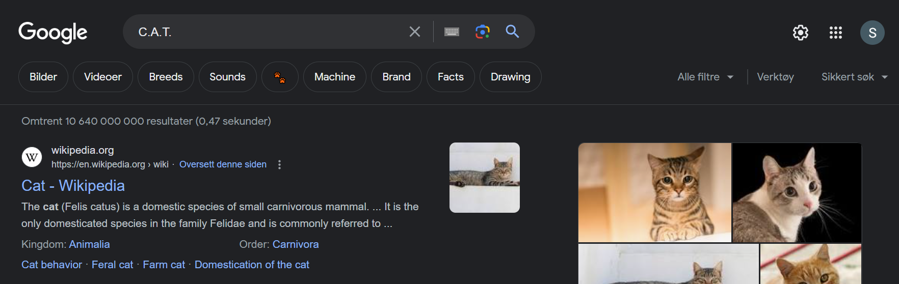
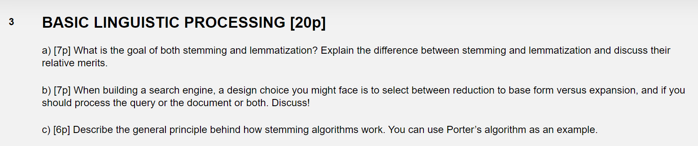
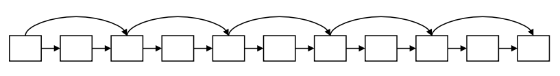
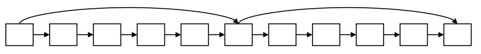
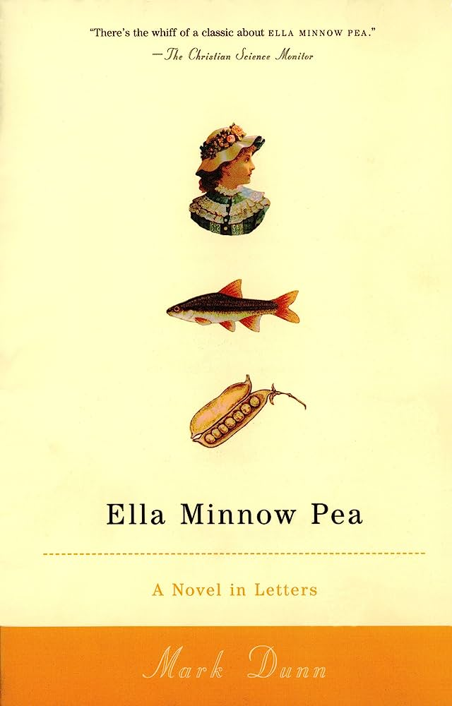

# Uke 2

## Hjelp, jeg vet ikke hva stemming osv er

Det gjorde ikke jeg heller da jeg tok kurset! Men vi kan prøve oss litt frem sammen.

### Tokenisering

Vi bryter opp teksten i **tokens**. Noen ganger er det ganske rett frem:

- "Informatikk er gøy" gir tokensene "informatikk", "er" og "gøy"
- "Kakeoppskrift uten egg" gir tokensene "kakeoppskrift", "uten" og "egg"

Noen ganger er det mindre rett frem:

- "Oslos hovedstad". Skal vi la "Oslos" være en token, eller gjøre den om til "Oslo"? Eller "Oslo sin"?
- "San Fransisco". Skal det være ett eller to tokens?

### Internasjonalisering

Vi tar høyde for hvordan ting skrives på andre språk. For eksempel skrives "salaten" _l'insalata_ på italiensk. Skal vi bryte opp _l'_ og _insalata_? Slik vi bryter opp "the" og "salad" på engelsk?

På norsk og tysk kan sammensatte ord bli noe lange (spesielt på tysk), og vi tjener på å bryte dem opp (rare orddelingsfeil W). På kinesisk og japansk er det ingen mellomrom mellom ordene i det hele tatt(!), og på japansk kan vi til og med benytte ulike alfabeter i samme setning(!!)

På blant annet hebraisk og arabisk skriver vi _tekst_ fra høyre til venstre, men _tall_ fra venstre til høyre!

### Normalisering

Vi fjerner f.eks. bindestreker og punktum fra forkortelser. Anti-diskriminering bli til antidiskriminering, og U.S.A. bli til USA. Aksenter og umlauts blir fjernet, så résumé og tübingen blir til resume og tubingen. Tenk på det: Ville du skrevet résumé eller resume i søkefeltet til Google?

**Case folding** er å gjøre alt til små bokstaver. Gravemaskinselskapet C.A.T. (Caterpillar Inc) normaliseres til CAT og case foldes til cat, og vi står igjen med søte kattepuser istedenfor tøffe gravemaskiner.



### Lemmatisering

Vi redusere varianter av ord til grunnformen. For eksempel kan de engelske ordene "am", "are" og "is" alle lemmatiseres til "be" (ja og på norsk kan vi lemmatisere "er", "er" og "er" til "være").

Ord som "bedre" og "dårligere" lemmatiseres til "bra" og "dårlig".

### Stemming

Vi redusere termer til deres "stammer". For eksempel kan de engelske ordene "running", "runs" og "run" bli redusert til "run".

### Så det er bare et annet ord for lemmatisering?

Ikke helt, min venn.

**Lemmatisering** \
Reduserer til grunnformen (f.eks. "better" -> "good")

**Stemming** \
Fjerner suffiksen (f.eks. "run**ning**" -> "run")

### Whatever, det kommer sikkert ikke på eksamen uansett

Hvem vet! Det kom på eksamen i fjor...



### Porters algoritme

Den vanligste stemme-algoritmen for det engelske språket. Den ordner fem ting:

1. Fjerner flertall-suffikser som "s" og "es" fra ord
2. Fjerner suffikser relatert til verbbøying som "ed", "ing", "est" etc.
3. Endrer "y" i slutten av ord til "i" (f.eks. "happy" -> "happi")
4. Fjerner spesifikke suffikser som "ational", "tional" etc.
5. Fjerner spesifkke suffikser som "ence", "ic", "able" etc.

Dog sjekkes det også for hvor stor suffiksen er i forhold til hele ordet. Det gir mening å gjøre \
**replacement** [ **-ement** ] -> **replac**

Men det gir ikke mening å gjøre \
**cement** [ **-ement** ] -> **c**

## Boolean retrieval continued

Forrige uke snakket vi om boolean retrieval, der

> "informatikk" **AND** "gøy"

med følgende inverterte indeks

```python
inverted_index =
{
    "informatikk": [1, 2, 4, 5, 7, 8, 9, 12, 14, 18],
    "er": [1, 2, 4, 5, 6, 7, 9],
    "gøy": [1, 4, 7, 8, 9]
}
```

ga oss

```python
resulting_documentIDs = [1, 4, 7, 8, 9]
```

Fremgangsmåten er ganske intuitiv:

- 1. Sammenlign den første docIDen i begge postinglistene
- 2. Hvis de er like, legg det til i resultat-lista, og øk begge pekerne
- 3. Hvis de er ulike, øk den minste pekeren.
- 4. Gjenta fra steg 2 frem til den minste postinglista er traversert

Greit nok kjøretidsmessig, men det kan også (potensielt) optimaliseres gjennom **skip-pekere**.

### Skip-pekere

Hva om den inverterte indeksen egentlig så slik ut

```python
inverted_index =
{
    "informatikk": [1, 2, 3, ..., 58, 59, 60],
    "er": [1, 4, 5, 6, 7, 9],
    "gøy": [1, 59]
}
```

Altså at "gøy" forekommer i to dokumenter, mens "informatikk" forekommer i 60. Da blir det litt meningsløst å skulle flytte pekeren i lista til "informatikk" 58 ganger før vi får et nytt treff.

Skip-pekere er "checkmarks" i listene. La oss tenke at _dette_ er postinglistene til "informatikk" og "gøy" (dette er siste gangen jeg endrer dem, lover):

**informatikk** -> [2, 4, 8, 41, 48, 64, 128]

**gøy** -> [1, 2, 3, 8, 11, 17, 21, 31, 39]

Etter at vi har matchet 8 i begge listene, flytter vi begge pekerne ett hakk frem. Da sammenligner vi docIDene 41 og 11. Men vi ser også at 41 er høyere enn noen andre docIDer i postinglista til gøy! Istedenfor å sammenligne hver bidige docID, kan vi plassere skip-pekere rundt i lista, f.eks. slik:

**informatikk** -> [**2**, 4, 8, **41**, 48, 64, **128**]

**gøy** -> [**1**, 2, 3, **8**, 11, 17, **21**, 31, 35, **39**]

Her er tanken at det finnes en skip-peker fra hvert tall i tykk skrift til det neste tallet i tykk skrift (f.eks. hos "informatikk": fra 2 til 41 og fra 41 til 128). Når (de "vanlige") pekerne er på 41 og 11, kan vi sjekke skip-pekeren til "gøy". Siden den peker til 21, som er mindre enn det pekeren til "informatikk" peker på, kan vi flytte pekeren til "gøy" til 21, uten å måtte sjekke det som ligger imellom!

### Taktisk plassering av skip-pekere

Si vi har mange skips:



**Fordel:** større sjans for å skippe \
**Ulempe:** må sammenligne skip-pekere ofte, og i lengden blir det omtrent like dyrt som å sammenligne de vanlige pekerne

Si vi har få skips:



**Fordel:** færre sammenligninger med skip-pekere \
**Ulempe:** mindre sannsynlig at vi skipper, så poenget med skip-pekerne forsvinner

En kjent heurestikk er følgende:

> Hvis en postingliste har lengde L, kan vi plassere skips med mellomrom på størrelse $\sqrt{L}$

Dette er gjort i postinglista til "gøy" i eksemplet over. Men det forutsetter også at postinglista er statisk! Hvis den manipuleres må vi inn og rydde, og det er stress.

## Wildcard queries

Wildcard-spørringer går ut på å kjøre mer generiske spørringer. For eksempel kan vi kjøre "mon\*", og få alle dokumentene som inneholder ord som _starter_ med "mon". Her kunne vi brukt et B-tre og lagret alle ordene mellom mon og moo i en range.

Det er vanskeligere å søke på "\*mon", altså der mon er _suffiksen_ på ordene. Et alternativ er å ha et ekstra b-tre der alle termene er lagret baklengs.

### Hva med wildcards i midten av ord, f.eks. "v\*t"?

Vi kan slå opp "v\*" i det vanlige B-treet og "\*t" i det alternative B-treet, også ta vare på snittet av resultatene. Men dette er dyrt!

Alternativet er å ha en ekstra indeks som mapper fra en versjon av termer til den faktiske termen.

### Permuterm-indekser

Dette er en måte å håndtere wildcards i midten av en term. Det går ut på å legge inn _rotasjoner_ av termene inn i indeksen.

For "informatikk", vil det roteres slik:

```
"informatikk$" -> "nformatikk$i" -> "formatikk$in" -> ... -> "k$informatik".
```

```python
permuterm_index = {
    "informatikk$": "informatikk",
    "nformatikk$i": "informatikk",
    "formatikk$in": "informatikk",
    ...
    "k$informatik": "informtatikk"
}
```

Vi roterer også spørringen vår. Hvis vi søker på "i\*k", får vi

```python
i*k$
*k$i
k$i*
```

Målet er å få wildcardet helt til høyre, altså **k$i\***. Denne kan man matche på **k$informatik**, da de har lik prefiks (altså **k$i**).

Problemet er at vi bruker mye plass, siden vi lagrer hver enkelt rotasjon, så et alternativ er **k-gram indekser**:

### K-gram index

I dette kurset ser vi bare på tilfellet der k=2, altså **bigram-indekser**. Gitt ordet "informatikk", får vi følgende bigrams:

```
$i, in, nf, fo, or, rm, ma, at, ti, ik, kk, og k$
```

Dermed kan en bigram-indeks se noenlunde slik ut:

```python
bigram_index = {
    "$i": ["informatikk", "ingen"],
    "in": ["informatikk", "invitasjon"],
    "nf": ["anfall", "informatikk"],
    "fo": ["before", "informatikk"],
    ...
    "k$": ["taktikk", "informatikk"]
}
```

Om vi søker på

> i\*k

Så tar vi snittet av termene fra \$i og k\$, og bruker dem til å søke i den inverterte indeksen.

### Så hvilken bør jeg bruke?

Det kommer sikkert an på! Men i dagens systemer er bigram indekser oftere foretrukket, blant annet fordi det bruker så mye mindre minne.

## Trier

En minne-effektiv tre-datastruktur, som egner seg perfekt for prefiks-søk! Hver gren representerer en bokstav, og hver løv-nøde er garantert et ord. Ord som ikke er løv-noder kan også forekomme, men de må merkes på et vis.

Toppen av en trie er rotnoden, og den representerer ikke noen bokstav.

```python
*
```

Hver gren er en bokstav.

```python
   *
  / \
 s   j
```

Hvis vi har to ord som har en overlappende prefiks, grener vi bare ut idet overlappen er ferdig.

```python
     *
    / \
   s   j
   e
  / \
 l   n
```

Over har vi lagret "sel", "sen", og "j". Om vi også ønsker å lagre "se", må vi markere det på et vis. For eksempel:

```python
     *
    / \
   s   j
   e'
  / \
 l   n
```

For å sjekke om trien inneholdr et ord, kan man bare følge bokstavene, og "ta med" bokstavene på veien. Hvis vi kommer til en løvnode før vi har funnet ordet vi lette etter, betyr det at ordet ikke finnes i trien.

[Her](https://open.kattis.com/problems/nicknames) er en morsom oppgave der trier fungerer utmerket!

## Suffix arrays

Suffix arrays brukes for å søke etter mønster i tekster eller andre ord. Det er også nyttig for å lete etter spesifikke DNA-sekvenser i et giga DNA. Det mest klassiske eksemplet på suffix arrays bruker ordet "banana".

Først genererer vi alle suffiksene

- banana
- anana
- nana
- ana
- na
- a

Deretter enumererer vi hver suffiks

- banana, 0
- anana, 1
- nana, 2
- ana, 3
- na, 4
- a, 5

Til slutt sorterer vi dem alfabetisk

- a, 5
- ana, 3
- anana, 1
- banana, 0
- na, 4
- nana, 2

En enkel eksempelimplementasjon finner dere [her](https://github.com/aohrn/in3120-2023/blob/main/gruppetimer/Gruppe%202/Uke%2002/suffixarray.py). Siden arrayenes er sortert alfabetisk, kan vi anvende binærsøk på dem, som gjør at vi finner eventuelle substringer og deres offset inn i teksten/ordet i O(log n), som er veldig bra!

## Ukas bok

Ella Minnow Pea. Går ut på at færre og færre bokstaver blir tillatt. Veldig gøy å se hvor mye man får til å skrive med få bokstaver. Lettlest og morsom. Anbefales veldig, og på en måte relevant? Kanskje?


