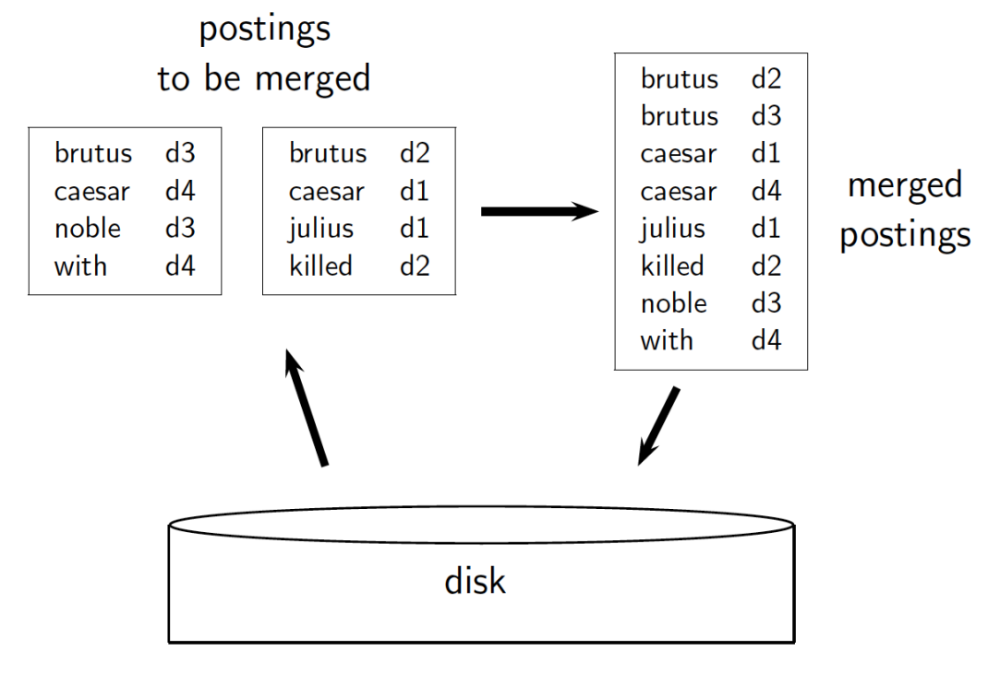
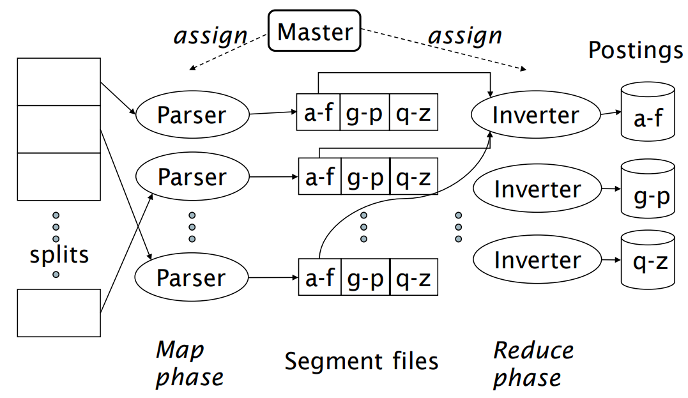

# Uke 3

Denne uka er jeg i Nord-Norge, så vi kjører Zoooom!!

## Ordboka

Alle stegene i søketeknologi kan optimaliseres, og ordboka er intet unntak. For eksempel: hvordan skal vi i det hele tatt representere den?

La oss først bli enige om definisjonen av en "ordbok":

> En ordbok består av termer, frekvensen deres (hvor mange dokumenter den forekommer i), og en referanse til postinglisten deres (alle dokumentene den forekommer i).

### Forslag 1: Array

Et enkelt eksempel kan være et array av entries:

```java
class Entry {
    char term[20];
    int documentFrequency;
    Postinglist postinglist;
}

Entry dictionary = new Entry[350000];
```

I følge [språkrådet](https://www.sprakradet.no/svardatabase/sporsmal-og-svar/antall-ord-i-norsk/), har vi over 330000 norske ord, så vi har sikkert litt flere termer. Hver term får være opp til 20 bokstaver.

**Fordeler**

- Veldig sweet når termen har nøyaktig 20 bokstaver og er i haugevis av postinglister

**Ulemper**

- Hvis termen har færre enn 20 bokstaver, har vi kastet bort minne
- Hvis termen har flere enn 20 bokstaver, får vi ikke plass til hele
- Integers er 4 bytes, som i noen tilfeller er mange flere enn vi trenger
- Språket er alltid i endring, og vi kommer til å overstige 350000 termer på et tidspunkt.
- Hvis vi plass til fler termer enn nødvendig kaster vi også bort plass
- Knotete å søke etter termer, med mindre ordboka er sortert alfabetisk
- osv.

### Forslag 2: HashMap

Tilsvarende dictionaries i Python:

```python
dictionary = {
    "term": {
        doc_freq: 4,
        postinglist: [1, 2, 3, 4]
    },
    ...
}
```

**Fordeler:**

- Amortisert O(1) på oppslag
- En dynamisk måte å legge til nye termer

**Ulemper:**

- Ingen god måte å skille små forskjeller/typos
- Ikke noe prefiks-søk
- Vil omsider fylle opp ordboka, og da må vi rehashe (flytte alle oppføringene inn i en ny ordbok: dyrt!).

### Forslag 3: Trær

En klassisk datastruktur!

**Fordeler:**

- Mulig å kjøre prefiks-søk
- Enkelt legge til nye oppføringer
  - Må heller aldri rehashe
- O(log n) på oppslag (tregere enn O(1), men fortsatt bra!)

**Ulemper:**

- Avhengige av at trærne er ordnet og balanserte for bra kjøretid
  - Spesielt balanseringen kan være knotete

Alternativer til selv-balanserende trær er

- AVL-trær
- Rød-svarte-trær
- B-trær

De to førstnevnte er binære søketrær, som innebærer at de maksimalt har to barn. En gjev fordel er at de er enklere å implementere enn B-trær. De er også optimalisert for å ha så lav høyde som mulig, som gir kjappere oppslag i praksis.

B-trær har [n, m] barn. De er optimalisert for maskinvare, da de passer inn i en disk-blokk, noe som fører til færre disk-operasjoner. Dermed er de best egnet for veldig store datasett, der disk-oppslag forekommer ofte.

En greie med B-trær er at man beholder foreldrenoder i hovedminnet, med referanser til barna. Dermed har man mange flere referanser tilgjengelig enn med binære trær, der man må hente barn oftere for å se deres referanser.

### Så hvilken er best?

Det kommer an på!

Hvis man bare kjører henting og aldri innsetting, vil det lønne seg å bruke HashMap. Hvis man kun skal gjøre prefiks-søk, vil trær være et mer naturlig valg. Hvis man har et fast antall termer, som alle består av nøyaktig 20 bokstaver, så tja, kanskje man skulle kikka litt mer på det arrayet?

## Hva om vi staver noe feil i spørringen vår?

Da trenger vi hjelp. Det finnes to alternativer:

- Kontekstfri retting: se på ordene hver for seg, sjekker bare ord som faktisk er skrevet feil
- Kontekstsensitiv retting: se på ordene i sammenheng, og rette opp f.eks. verbbøying

Si at vi googler "ifnormatikk"


Trolig ga søket veldig få resultater. Men "informatikk", et ord som ligner VELDIG, ga mange fler! Da tar søkemotoren en sjefsavgjørelse, og antar at vi egentlig mente "informatikk". Dette kalles **hit based spelling correction**.

### Hvordan vet søkemotoren hvilket ord i en setning som er stavet feil?

Ved hjelp av en "orakel-ordbok", der alle ordene er riktige! Hvis ordet vi søkte på ikke finnes der, skrev vi det antakeligvis feil.

Siden søkemotoren ønsker å gi deg de beste resultatene, kan den ikke bare gjette på hva vi egentlig mente! Gjerne vil en av disse algoritmene benyttes:

- Edit distance (Leveshtein distance)
- Vektet Levenshtein distance
- n-gram overlapp

### Levenshtein distance

**Levenshtein distance** er en type [edit distance](https://en.wikipedia.org/wiki/Edit_distance)-algoritme.

Hva er det færreste antall operasjoner vi trenger for å transformere en streng til en annen? Operasjonene vi har er sletting, innsetting og bytting, og hver operasjon koster 1.

- klingformatikk -> informatikk = 3.
  - Vi sletter char 0, 1 og 4 (k, l og g)
- ifnormatikk -> informatikk = 1.
  - Vi bytter plass på char 1 og char 2 (f og n)
- format ick -> informatikk = 4.
  - Vi legger til char 0 og 1 (i og n)
  - Vi sletter char 7 (mellomrommet)
  - Vi bytter char 9 (c -> k)

#### Utfordring: Progg din egen Levenshtein-kalkulator!

Vi har også **vektet Levenshtein distance**. Vi vekter ulike bokstaver etter hvor de forekommer på tastaturet. For eksempel er det med naturlig å skrive "fu" enn "lu" istedenfor "du", fordi "d" er mye nærmere "f" enn "l" på tastaturet.

Til sist har vi **n-gram overlaps**. Vi lister alle n-grammene i spørringen, og sammenligner med andre n-grammer. For eksempel kan vi dele "November" og "Desember" inn i følgende trigrammer:

- nov, ove, vem, emb, mbe, ber
- des, ese, sem, emb, mbe, ber

Her er det overlapp mellom tre trigrammer (de tre siste).

### Jaccard-koeffisient

Vi er nødt til å "måle" overlappen på et vis. Etter å ha delt de to termene inn i n-grammer, kan vi legge dem i to mengder: X og Y. Jaccard-koeffisienten blir lengden av snittet av X og Y delt på lengden av unionen av X og Y.

{emb, mbe, ber} / {nov, ove, vem, emb, mbe, ber, des, ese, sem} \
3 / 9 = 0.333...

Vi bestemmer selv hva som er høyt nok for å være en match, men spennet er [0, 1].

## Soundex

Her tar vi for oss **fonetiske ekvivalenter**, altså ting som _høres_ likt ut. For eksempel er det mange måter å skrive russiske navn på, men Chebyshev og Tchebycheff bør vise de samme resultatene.

Det kan brukes for å søke etter navn som uttales likt, men kan skrives forskjellig. Det er smud og nice om man leter etter en internasjonalt etterlyst person, for da ønsker man så høy recall som mulig. Ellers er den ikke kjempeflittig brukt.

## Index construction

Hvordan vi bygger indeksen vår, avhenger ofte av maskinvaren vi har tilgjengelig.

### Hva er greia med hovedminne/disk?

Hovedminne er registre, cache, RAM osv. Dette ligger veldig nært kjærnen av datamaskinen, **CPU**en. Her lagrer vi det vi _må_ ha lett tilgjengelig. Resten lagrer vi på disken.

### Problemet

Det tar lengre tid å hente fra disken enn det gjør å hente fra hovedminnet. Å hente data fra disken kalles en **disk seek**, og dette er dyrt.

Det er derfor bedre å overføre én stor chunk om gangen, istedenfor å hente mange små etter hverandre. Data leses i _blokker_ på 8KB til 256KB om gangen.

### Reuters RCV1

I forelesningen brukes korpuset **Reuters RCV1** (RRCV1). Det er bare en samling med dokumenter. Det gjør det enklere å se hvordan maskinvaren har noe å si i praksis.

RRCV1 består av 800K dokumenter, og hvert dokument består i gjennomsnitt av 200 tokens.

### Invertert indeks av RRCV1

Vi tar hvert dokument og lager en mapping fra term til docID. Si vi har disse to små dokumentene:

> The quick brown fox

og

> A brown cat walks

Da kan vi lage følgende mapping fra term til dokumentID:

| Term  | DokumentID |
| :---: | :--------: |
|  The  |     1      |
| quick |     1      |
| brown |     1      |
|  fox  |     1      |
|   A   |     2      |
| brown |     2      |
|  cat  |     2      |
| walks |     2      |

Også sorterer vi ordboka alfabetisk:

| Term  | DokumentID |
| :---: | :--------: |
|   A   |     2      |
| brown |     1      |
| brown |     2      |
|  cat  |     2      |
|  fox  |     1      |
| quick |     1      |
|  The  |     1      |
| walks |     2      |

### Greit nok det?

For disse to dokumentene alene ja, men RRCV1 består av ca. 100 millioner termer. Dagens maskinvare tillater har ikke kapasitet til å ha hele korpuset i hovedminnet (og RRCV1 er egentlig et lite korpus sammenlignet med mange andre!).

### Husk problemet!

Det er kjempedyrt å jobbe på disken! Vi bygger posting-innslagene fra ett og ett dokument om gangen. Så skal hvert av dem sorteres, før vi sorterer hver term sin postingliste.

**Utfordring:**

> En disk seek tar 2 millisekunder, og vi sorterer de 100 millioner termene med en algoritme som går i O(n log n). Hvor lang tid tar det før vi er ferdige?

<details>
  <summary>Drum roll...</summary>

40 dager! Det er lenge det.

Antall disk seeks blir 100m \* log2(100m) = **1.735 milliarder**. Hvis hver disk seek tar 2 millisekunder, vil vi bruke **3.47 milliarder millisekunder**, aka **40.1 dager**.

</details>

## Sort-based index construciton

En potensiell løsning! I forelesningen så vi på to varianter: Blocked sort-based indexing (BSBI) og Single-pass in-memory indexing (SPIMI).

### Blocked sort-based indexing

Vi bryter korpuset opp i blokker, som er såpass store at vi har plass til én blokk i hovedminnet om gangen.

Den grunnleggende idéen er:

1. Vi leser én og én blokk (med dokumenter) fra disken
2. Tokeniser dokumentene
3. Opprett postinger på formen (term, dokument-ID) helt til vi har laget en invertert indeks av blokken
4. Skriv den tilbake til disken

Når vi har gjort dette med alle blokkene, kan vi lese deler av indekser fra minnet, merge dem, og skrive dem tilbake, helt til vi har en fullstendig invertert indeks.

> Repetisjon: en **posting** sier noe om forholdet mellom en term og dokumentet det forekommer i. Det kan være så enkelt som IDen til dokumentet termen forekommer i, men også mer avansert, om vi ønsker det.

Eksemplet fra forelesningen viser hva som skjer når alle blokkene er skrevet tilbake, og vi merger postings:



Den mest effektive måten å merge sammen postingene på er egentlig ikke en binær merge som vist over, men en såkalt _multi-way merge_, der vi merger fra alle blokkene (i hovedminnet) om gangen! Nøyaktig _hvordan_ dette foregår, er utenfor pensum :)

### Single-pass in-memory indexing

Som vi har snakket om tidligere, er det krevende å både lese og skrive til disken. Hvis vi har nok plass i hovedminnet, kan vi faktisk kjøre en annen variant.

Med SPIMI gjør vi det samem som sist: vi henter en blokk fra disken, og lager en invertert indeks ut av den. Men! Istedenfor å skrive den tilbake til disken, henter vi en ny blokk, lager en invertert indeks ut av den, og merger den inn i den vi allerede har. Så gjentar vi prosessen til vi står igjen med én stor og fin invertert indeks :)

## Distribuert indexing

Vi bør ikke overlate all jobben til én maskin, da den når som helst kan bli ødelagt. Istedenfor bør vi _distribuere_ jobben på flere maskiner.

> NB! Vi er fortsatt avhengige av én "hovedmaskin", men dens jobb er bare å dirigere oppgaver til andre maskiner.

Et klassisk rammeverk for distribuert indeksing heter **MapReduce**:

Vi deler opp korpuset i blokker, men her velger vi å kalle dem _splits_. Deretter deler vi opp jobben på to grupper: **parsers** og **inverters**.

Hver parser gjør følgende (Map-fasen):

- Blir tildelt en split av hovedmaskinen
- Leser et dokument av gangen fra spliten
  - Lager (term, docID)-par
- Skriver parene til en partisjon\*

Hver inverter gjør følgende (Reduce-fasen):

- Samler par fra én partisjon
- Sorterer parene og skriver dem til postinglister

> \*i forelesningen så vi 3 partisjoner: a-f, g-p og q-z. Par blir lagt i partisjonen tilsvarende termens første bokstav. (informatikk, 1) og (gøy, 1) havner i g-p, mens (er, 1) havner i a-f.

Eksemplet fra forelesningen viser dette fint, men kan være litt overveldende. For å forstå det bedre, kan det være en idé å tegne opp hver del, for å forstå flyten.



## Dynamisk indexing

I alle eksemplene over har vi antatt at korpusene er statiske. I virkeligheten blir de endret, lagt til og fjernet hele tiden, noe som medfører at postinglister må endres, og nye termer blir lagt til i ordboka.

Et alternativ er å ha én stor hoved-indeks, også legge nye dokumenter til å en mindre indeks på siden. Når man gjør et søk går man bare gjennom begge to. Om vi trenger å slette et dokument, kan vi "markere" det som slettet, og filtrere det vekk når vi søker. Etter hvert som den mindre indeksen blir større, kan vi merge den inn i den store. Problemet her er at merging kan være kostbart.

### Logaritmisk merge

Et annet alternativ er å ha en serie indekser, hvor hver av dem er dobbelt så stor som den forrige

```python
len(index1) # 256
len(index2) # 512
len(index3) # 1024
...
```

Den minste disken bevarer vi i hovedminnet, mens resten ligger på disken

```python
hovedminnet = [index1]
disken = [index2, index3, ...]
```

På et tidspunkt derimot, vil index1 bli for stor til å ligge i hovedminnet!

```python
len(index1) # for stor
```

Da skal vi i utgangspunktet skrive den til disken. Vi overlater en del av den i hovedminnet slik at vi har noe å jobbe med, før vi legger den på disken.

Om disken var tom, ville vi bare lagt den der. Men siden vi allerede har andre indekser på disken, må vi merge dem. Vi merger først index1 og index2. Deretter merger vi resultatet av dem med index3. Slik går vi helt til vi ikke har flere indekser å merge på disken.
