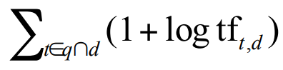
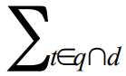
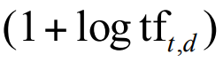
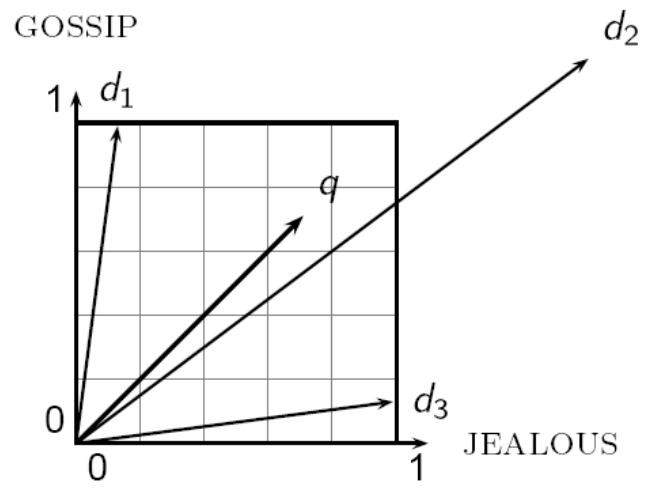
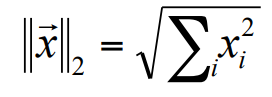
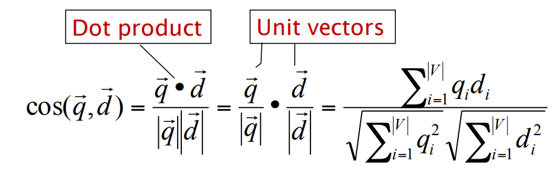

# Uke 5

## Ranked retrieval

Et av problemene med boolske spørringer er at resultatene ikke nødvendigvis er relevante for brukeren. En boolsk spørring på mail-inboksen går bra, men å alltid få opp de nyeste dokumentene på Google er ikke nødvendigvis like fornuftig. Istedenfor kjører vi _ranked retrieval_, der dokumenter blir rangert etter relevans!

Gitt at rangeringsalgoritmen fungerer, viser vi bare brukeren de `K` mest relevante dokumentene. For å holde styr på dette, kan vi gi hvert dokument en _rating_, mellom 0 og 1.

### Alternativ 1: Jaccard koeffisient

Vår kjære venn fra noen uker siden! Her er A = spørringen delt opp i ord, og B = dokumentet delt opp i ord. Fordi Dokumenter gjerne er svære, blir det litt teit å ta

```python
intersection(A, B) / union(A, B)
```

så istedenfor tar vi

```python
intersection(A, B) / square_root(union(A, B))
```

En betydelig ulempe med JC er at den ikke om hvor ofte ord forekommer, og _hvilke_ ord (feks stopp-ord vs ukjente ord)

### Alternativ 2: _Bag of words_ model

Vi ser på _hvor ofte_ termer forekommer i dokumenter og i spørringen, men vi ignorerer rekkefølgen. Så bruker vi denne frekvensen for å vekte termene og rangere dokumentene etter spørringen.

#### Term-frekvens

Det blir for simpelt å _bare_ se på frekvens. Et dokument der spørringen forekommer 10 ganger _er_ mer relevant enn et dokument der spørringen forekommer 1 gang, men ikke 10 ganger mer relevant! Et alternativ er å ta logaritmen av antall forekomster + 1!

> **Quick maths:** \
> 1 + log<sub>10</sub>(0) = 0 \
> 1 + log<sub>10</sub>(1) = 1 \
> 1 + log<sub>10</sub>(2) = 1.3 \
> 1 + log<sub>10</sub>(10) = 2 \
> 1 + log<sub>10</sub>(1000) = 4

Scoren for et dokument-spørring-par blir gitt med **log frequency weighting**, og vises med denne formelen:



Skummelt! La oss bryte opp formelen :)



Dette betyr

> Summen av verdiene til alle termene (t) som forekommer i spørringen (q) og dokumentet (d)

Verdiene til termene beregnes slik:



Noen av verdiene kan sees i "quick maths"-seksjonen. tf<sub>t,d</sub> betyr: antall forekomster av termen **t** i dokumentet **d**. så tar man logaritmen av det, legger til 1.

Dette gjøres for alle termene, og summen av verdiene legges til dokumentet.

#### Dokument-frekvens

Noen ganger er det ikke forekomsten av ordet som har så mye å si, men heller _hva slags ord det er snakk om_! For eksempel, hvis en spørring er

> the arachnocentric person

så er nok dokumenter som inneholder "arachnocentric" mye mer relevant enn dokumenter som inneholder "the"!

df<sub>t</sub> er **dokument-frekvensen** til t: Antall dokumenter t forekommer i. For å finne ut hvor sjeldent et ord er, kan vi _inversere_ dokument-frekvensen!

Vi beregner idf<sub>t</sub> slik:

> log<sub>10</sub>(N/df)

der N er antall dokumenter vi har totalt i korpuset.

Si at dette er noen ord i korpuset, der "the" er ordet som forekommer oftest:

| term      | df<sub>t</sub> |
| --------- | -------------- |
| the       | 1 000 000      |
| under     | 10 000         |
| fly       | 1 000          |
| sunday    | 100            |
| animal    | 10             |
| calpurnia | 1              |

Formelen vår gir termene følgende idf<sub>t</sub>:

| term      | df<sub>t</sub> | idf<sub>t</sub> |
| --------- | -------------- | --------------- |
| the       | 1 000 000      | 0               |
| under     | 100 000        | 1               |
| fly       | 10 000         | 2               |
| sunday    | 1 000          | 3               |
| animal    | 100            | 4               |
| calpurnia | 1              | 6               |

Og dermed vil et dokument som inneholder "calpurnia" mye bli vektet høyere enn et dokument som inneholder "the" mange ganger.

Det gir ikke mening å se på idf for spørringer med bare ett term, fordi poenget med idf er å stille termene i spørringen opp mot hverandre! Hvis spørringen er

> the calpurnia

og vi har disse to dokumentene:

> the calpurnia, my calpurnia!

> the calpurnia, and the other stuff that the shakespeare guy talked about

så vinner dokument 1, fordi det inneholder en "the" og to "calpurnia", som er mer verdt enn dokument 2 sine tre "the" og bare én "calpurnia".

Nå som vi vet hvordan vi regner tf<sub>t,d</sub>, og idf<sub>t</sub>, kan vi slå dem sammen for å vekte dokumentene våre!

Konseptet kalles _tf-idf_, der man ganger resultatet av tf og idf. Det er faktisk det dere skal gjøre i [Assignment D-1](https://github.com/aohrn/in3120-2023/blob/main/assignment-d-1.md)! :)

La oss prøve med de to dokumentene over!

> the calpurnia, my calpurnia!

tf<sub>the, doc1</sub> = 1 + log<sub>10</sub>(tf<sub>t,d</sub>) = 1 + log<sub>10</sub>(1) = 1 + 0 = 1 \
idf<sub>the</sub> = 0 \
tf-idf<sub>the, doc1</sub> = 1 x 0 = 0

tf<sub>calpurnia, doc1</sub> = 1 + log<sub>10</sub>(tf<sub>t,d</sub>) = 1 + log<sub>10</sub>(2) = 1 + 0.3 = 1.3 \
idf<sub>calpurnia</sub> = 6 \
tf-idf<sub>calpurnia, doc1</sub> = 1.3 x 6 = 7.8

Scoren til dokument 1 blir altså 0 + 7.8 = 7.8

> the calpurnia, and the other stuff that the shakespeare guy talked about

tf<sub>the, doc2</sub> = 1 + log<sub>10</sub>(tf<sub>t,d</sub>) = 1 + log<sub>10</sub>(3) = 1 + 0.47 = 1.47 \
idf<sub>the</sub> = 0 \
tf-idf<sub>the, doc2</sub> = 1.47 x 0 = 0

tf<sub>calpurnia, doc2</sub> = 1 + log<sub>10</sub>(tf<sub>t,d</sub>) = 1 + log<sub>10</sub>(1) = 1 + 0 = 1 \
idf<sub>calpurnia</sub> = 6 \
tf-idf<sub>calpurnia, doc2</sub> = 1 x 6 = 6

Scoren til dokument 2 blir altså 0 + 6 = 6

Og dermed vinner dokument 1 :)

tf-idf-scoren øker både med antall forekomster, og hvor sjeldne ordene er!

### Collection frequency

Korpus-frekvens kan også si noe om hvor viktig et ord er for dokumentet. Se for eksempel her:

| Ord         | Collection freq | Document freq |
| ----------- | --------------- | ------------- |
| Informatikk | 10440           | 3997          |
| Gøy         | 10442           | 8760          |

"Informatikk" og "gøy" forekommer ca. like ofte i korpuset, men "informatikk" forekommer i mange færre dokumenter! Det betyr at det nevnes oftere når det først er med, og er antakeligvis et ord som er ganske sentralt i de dokumentene det forekommer i.

## Dokumenter som vektorer

Vi kan se for oss et vektorrom som har |V| dimensjoner: like mange dimensjoner som vi har termer i vokabularet vårt. Termene er akser, og dokumentene er punkter/vektorer i rommet.

Herfra kan vi behandle spørringer som et dokument, og plassere dem i vektorromet! Derfra kan vi plukke dokumentene som ligger nærmest :D

Euklidisk distanse egner seg dårlig for å se på relevante dokumenter, fordi aksene er termer, så ord med identisk distribusjon vil være langt fra hverandre om de har ulik lengde!



Her ser vi at **q** og **d2** har veldig lik distribusjon av termene gossip og jealous, men fordi **d2** er er større enn **q**, så blir distansen kjempelang! Istedenfor er **q** nærmere **d1**, selv om de har ganske ulik distribusjon.

Vi kan lengdenormalisere dem, og deretter sammenligne vinklene deres!

#### Lengdenormalisere?

Nok en skummel formel!



Si at vi har to vektorer (3, 4) og (9, 12). De er ganske langt unna hverandre! Men vi kan anvende formelen på dem, og oppdage at de kanskje er likere enn vi tror!

Formelen sier at vi skal ta hver x i vektoren, og opphøye den i 2. Deretter tar vi kvadratroten av summen. Altså

```python
import math
a = math.sqrt(3**2 + 4**2)  # 5
b = math.sqrt(9**2 + 12**2) # 15
```

**a** og **b** er L<sub>2</sub>-normen til vektorene. Hva skjer om vi deler verdiene i vektorene på deres respektive L<sub>2</sub>-normer?

```python
(3/a, 4/a)  # (0.6, 0.8)
(9/b, 12/b) # (0.6, 0.8)
```

Wow!

## Men hva med denne skumle formelen?



Ved første øyekast ser det ut som en japansk tegneserie. Men den sier egentlig bare at vi skal ta kryssproduktet av to lengdenormaliserte vektorer! Hvis de allerede er lengdenormalisert, kan vi bare ta kryssproduktet.

Resultatet er vektorene **q** og **d** sin **Cosine similarity**.

### Praktisk eksempel

Hvor like er de tre bøkene Sense and Sensibility, Pride and Justice og Wuthering Heights? Ettersom de inneholder ganske mange ord, lar vi disse fire ordene definere likheten mellom dem: affection, jealous, gossip og wuthering. Vi nøyer oss med tf over tf-idf.

| term      | SaS | PaP | WH  |
| --------- | --- | --- | --- |
| affection | 115 | 58  | 20  |
| jealous   | 10  | 7   | 11  |
| gossip    | 2   | 0   | 6   |
| wuthering | 0   | 0   | 38  |

Vi vekter hver term med log-frequency weighting, der vi tar 1 + log<sub>10</sub>(tf). Da får vi denne tabellen:

| term      | SaS  | PaP  | WH   |
| --------- | ---- | ---- | ---- |
| affection | 3.06 | 2.76 | 2.3  |
| jealous   | 2    | 1.85 | 2.04 |
| gossip    | 1.3  | 0    | 1.78 |
| wuthering | 0    | 0    | 2.58 |

Vi kan også lengdenormalisere vektene, gjennom å ta summen av hver term^2, også ta kvadratroten av det igjen. Så deler vi hver term med dette tallet. De ulike L2-verdiene blir:

> SaS: $\sqrt{3.06^2 + 2^2 + 1.3^2} = 3.91$

> PaP: $\sqrt{2.76^2 + 1.85^2} = 3.27$

> WH: $\sqrt{2.3^2 + 2.04^2 + 1.78^2 + 2.58^2} = 4.47$

Om vi deler hver kolonne sin verdi med dens respektive L2-verdi, får vi denne tabellen:

| term      | SaS  | PaP  | WH   |
| --------- | ---- | ---- | ---- |
| affection | 0.78 | 0.84 | 0.51 |
| jealous   | 0.51 | 0.57 | 0.46 |
| gossip    | 0.33 | 0    | 0.40 |
| wuthering | 0    | 0    | 0.58 |

Så, for å vite hvor like to bøker er, kan vi ta dot-produktet av verdiene deres! For SaS og PaP blir det følgende:

> (0.78 \* 0.84) + (0.51 \* 0.57) + (0.33 \* 0) + (0 \* 0) = 0.94

Det som også er litt morsomt, er at SaS og PaP har samme forfatter! Ikke så rart at de er like da, kanskje :))
