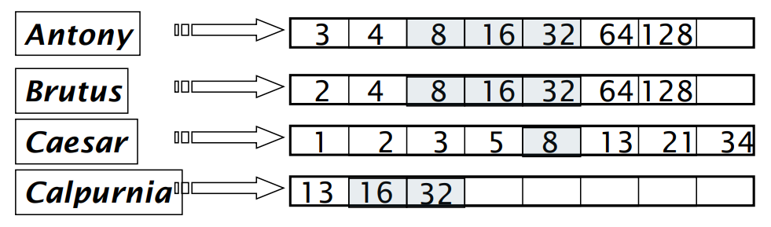
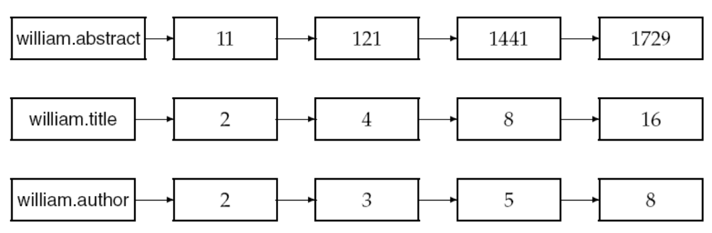
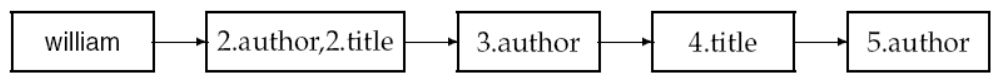

# Uke 6

## Effektiv cosine-scoring

Først og fremst ønsker vi å score dokumentene våre _effektivt_! Når vi bruker en søkemotor som Google eller [Kvasir](https://www.kvasir.no/), ønsker vi ikke nødvendigvis å få opp _alle_ de relevante treffene, spesielt om det går på bekostning av tid. Drømmen er at søkemotoren klarer å gi oss _bare de **mest**_ relevante treffene, på en effektiv måte!

Den største flaskehalsen er å beregne dokumentenes `cosine` score.

Istedenfor å beregne scoren til _alle_ dokumentene i korpuset, for så å sortere dem etter score, ønsker vi bare å hente de `K` mest relevante dokumentene.

Her skiller vi på **safe scoring** og **non-safe scoring**.

## Safe scoring

Med safe scoring vil alle de `K` beste dokumentene bli returnert! Et alternativ her er å bruke en **heap**.

### Hva var det igjen?

En heap er en tre-datastruktur, og fungerer slik at det "beste" elementet sitter på toppen, med alle andre elementer under seg. Dette gjelder også for hvert subtre! Så hvis vi ønsker noder med høy vekt, kan en _max-heap_ se slik ut:

```python
              20
            /    \
          19      17
         /  \    /  \
        15   4  12  16
```

Hvert subtre sin rotnode er større enn alle barn-nodene. Hvis `K = 3`, kunne vi bare tatt de tre øverste dokumentene. [Sieve](https://github.com/aohrn/in3120-2023/blob/main/in3120/sieve.py)-datastrukturen i repoet er faktisk en løsning på dette: en heap med plassbegrensning!

### WAND scoring

Et annet alternativ er WAND scoring! Denne er enklest å forklare direkte gjennom et eksempel.

Si at vi har følgende spørring

> informatikk er gøy

Vi skal i utgangspunktet gå gjennom dokumentene i postinglistene deres. Si at oversikten ser slik ut:

| doc id | informatikk | er  | gøy |
| ------ | ----------- | --- | --- |
| 1      | ✔️          | ✔️  | ❌  |
| 2      | ✔️          | ❌  | ✔️  |
| 3      | ❌          | ✔️  | ✔️  |
| 4      | ✔️          | ✔️  | ✔️  |
| 5      | ✔️          | ❌  | ❌  |

Så må vi gi (dokument, term)-par en score. Scoren kan, for enkelthetens skyld, være termfrekvens.

I realiteten vil vi operere med enda flere faktorer (f.eks. tf-idf). Derfor er det ineffektivt å skulle beregne hvert eneste (dokument, term)-par, og kombinere dem for hver term osv.

Istedenfor legger vi inn en "upper bound" for hver term. Det vil si, det vi antar er den største verdien en term kan få for ethvert dokument.

| term        | upper bound |
| ----------- | ----------- |
| informatikk | 5           |
| er          | 4           |
| gøy         | 3           |

Samtidig har vi en grense, som forteller oss om dokumentet er "godt nok" til å være blant de `K` vi gir til brukeren. Grensen kan starte på 0.

Nå kan vi begynne å score dokumenter! Vi kan starte med å regne ut verdien for (doc 1, informatikk):

| doc id | informatikk | er  | gøy |
| ------ | ----------- | --- | --- |
| 1      | 3           | ?   |     |
| 2      | ?           |     | ?   |
| 3      |             | ?   | ?   |
| 4      | ?           | ?   | ?   |
| 5      | ?           |     |     |

Istedenfor å regne ut verdiene for `(doc 1, er)` og `(doc 1, gøy)`, kan vi benytte `upper bound`-verdiene, som gir oss en potensiell maksverdi!

Da får vi

> 3 + 4 + 3 = 10

Ettersom 10 > 0 (som var grensa vår), kan vi regne ut den _egentlige_ verdien til `er` og `gøy`. Resultatet av dette blir den nye grensa!

Om maksverdien er under grensa, skipper vi dokumentet. Slik unngår vi å regne ut `cosinen` for alle dokumentene i postinglistene!

I praksis itererer vi faktisk hver postingliste parallell, fra laveste id til høyeste. Vi synkroniserer pekerne, slik at vi unngår å gjøre samme beregning flere ganger.

## Non-safe scoring

Vi kan også ta noen snarveier, også kalt `non-safe scoring`, men da risikerer vi at dokumenter som ikke egentlig er blant de `K` mest relevante sniker seg med!

På én side er det uheldig, men på en annen er jo cosinen bare et _estimat_ på hvor bra dokumentet er. Naturligvis kan vi ikke vite _nøyaktig_ hva brukeren er ute etter, bare basert på en enkel spørring!

> Safe scoring betyr at vi returnerer de `K` beste dokumentene. Non-safe scoring betyr at de `K` dokumentene vi returnerer ikke nødvendigvis var de `K` beste. Fordelen med sistnevnte er at vi behøver færre beregninger.

### Generic approach

Vi tar en mengde med _kandidater_, som vi kaller A. A inneholder flere dokumenter enn `K`, men ikke alle dokumentene i korpuset. Vi kan skrive det slik:

> K < |A| < N

Så gir vi brukeren de `K` beste dokumentene fra A!

### Men hvordan finner vi A?

Slik det har vært til nå, har vi beregnet cosine for alle dokumentene som hver term består av. Dette kan optimaliseres!

Et alternativ er å bare se på termer med høy TF-IDF-score, altså _sjeldne_ termer. I et søk på `catcher in the rye`, blir `in` og `the` for "vanlige".

Et annet alternativ er å ikke rangere alle dokumentene til termen, men heller bare se på dokumenter som inneholder så så mange av termene i spørringen:



Bildet over viser hvordan vi først plukker ut dokumenter som forekommer i minst 3 av 4 termer i spørringen `Antony Brutus Caesar Calpurnia`, før vi scorer og rangerer dokumentene. Dette er faktisk det dere skal gjøre i [Assignment C](https://github.com/aohrn/in3120-2023/blob/main/assignment-c.md) :)

### Champion lists

Hver term har en postingliste. I tillegg til denne listen, kan vi ta vare på en **champion list**, som består av de `R` beste dokumentene. Så, når brukeren gir oss en spørring, så kan vi begrense oss til å rangere postinger fra denne lista!

Drawback: Vi vet ikke `K` på forhånd, så det kan hende at `R` < `K`, og at brukeren får tilbake færre dokumenter enn ønsket.

### High & low lists

En måte å vegre oss mot at `R` < `K`. Hver term vedlikeholder _to_ lister, en **high list** og en **low list**. Vi kan tenke på high list som det ekvivalente av **champion list**.

Hvis `R` >= `K`, så returnerer vi bare de `K` beste dokumentene fra high list. Hvis ikke, begynner vi å hente dokumenter fra low list.

### Tiered indexes

Vi kan ta dette _enda_ et hakk lenger, og dele opp i enda flere hierarkier. Det øverste er de viktigste dokumentene, og det laveste er de minst viktige dokumentene.

Når vi skal hente ut dokumenter, itererer vi liste for liste (fra toppen og ned) til vi har `K` dokumenter.

### Static quality scores

De beste dokumentene burde være relevant og ha _autoritet_. Med autoritet mener vi at dokumentet må være et "ordentlig" dokument, f.eks. et paper med mange siteringer, noe fra Wikipedia eller en anerkjent avis etc. Vi kan gi hvert dokument en autoritets-score mellom 0 og 1, og kalle det `g(d)`

Relevans måles altså av cosine-scoren, mens autoritet er noe som er uavhengig av brukerens spørring.

For å score en spørring mot et dokument kan man ta

```python
netScore(q, d) = g(d) + cosine(q, d)
```

Herfra returnerer vi de `K` beste dokumentene etter deres "netScore".

> Vi sier at `g(d)` er en _statisk_ score, mens `cosine(q, d)` er en _dynamisk_ score.

Ettersom et dokuments `g(d)` vil være den samme på tvers av postinglister, kan vi sortere termenes postinglister basert på g(d), også skille uavgjorter på doc-id.

Vi kan også la oss inspirere av champion lists, og ha en slags champion list for hver term, der dokumenter rangeres på

> g(d) + tf-idf<sub>t,d</sub>

### Impact-ordered postings

For å spare tid, ønsker vi kun å beregne scoren til dokumenter med høy nok wf<sub>t,d</sub>-score.

> _wf_ står for "weight function". Et eksempel på en wf er tf-idf.

Men hva om spørringen består av flere termer?

Problemet med dette er at hver postingliste er ordnet i forhold til termen deres, istedenfor en global standard. Altså, et dokument har den samme g(d)-scoren uavhengig av hvilken postingliste den er i. Men det samme dokumentet kan ha to forskjellige tf-idf-scores, basert på hvilken term det tilhører!

Et alternativ her er å sette en maks-grense, og også slutte å ta dokumenter som ikke oppfyller den (enten et satt antall, eller f.eks. wf-scoren deres). Deretter tar man unionen av dokumentene, og scorer dem.

### Cluster pruning

Vi plukker √N dokumenter til å være **ledere**. Deretter finner vi alle andre dokumenters nærmeste leder. Så, gitt en spørring, returner den nærmeste lederen, og lederens `K` nærmeste dokumenter.

Den største fordelen med dette, er at spørringen bare trenger å sammenlignes med √N dokumenter.

Man kan også utvide dette til å si at dokumentene skal følge flere enn én leder. Da kan man også ordne det slik at spørringen vår henter dokumenter fra de `N` nærmeste lederne, og ikke bare den alle nærmeste.

### Soner og parametre

Så langt har vi bare sett på dokumenter som en sekvens av termer, men dokumenter kan også bestå av ulike parametre! Et parameter kan være alt fra tittel og språk til dato og format.

Dermed kan spørringen vår være mer presis, og spørre etter f.eks.

```python
year=1999
```

for å finne alle dokumenter som ble opprettet i 1999. For at dette skal foregå så effektivt som mulig, vedlikeholder vi en indeks for hvert av disse parametrene.

Vi kan også bytte indekser på **soner**, altså _hvor_ i dokumentet informasjonen befinner seg! Her kan vi skille på ting som tittel, abstract, footer etc.

Vi kan enten mappe hver terms sone til postinger:



Eller legge sonene direkte inn i "vanlige" postinger:


