# Uke 8

## Resultatforbedring

Når vi søker etter "aircraft" på Google, er det ingenting i spørringen som direkte indikerer at vi også er ute etter resultater for "plane", "helicopter" etc.

Vi skal se på to metoder for å løse det problemet: Relevance feedback (lokalt tiltak) og Query expansion (globalt tiltak)

## Relevance feedback

Dette går ut på at vi (søkemotoren) jobber _sammen_ med brukeren! Vi presenterer noen resultater, også kan brukeren si fra hva hen synes, også kan vi gi nye, forbedrede resultater basert på tilbakemeldingen.

Litt av poenget med dette, er at brukeren ikke alltid vet hvordan hen skal formulere behovet sitt. Det er enklere å komme i mål hvis man kan jobbe sammen!

### Bilderesultater

Sykkel-eksemplet fra forelesningen viser dette godt:

1. Vi søker etter "sykkel"
2. Vi får følgende resulteter:
   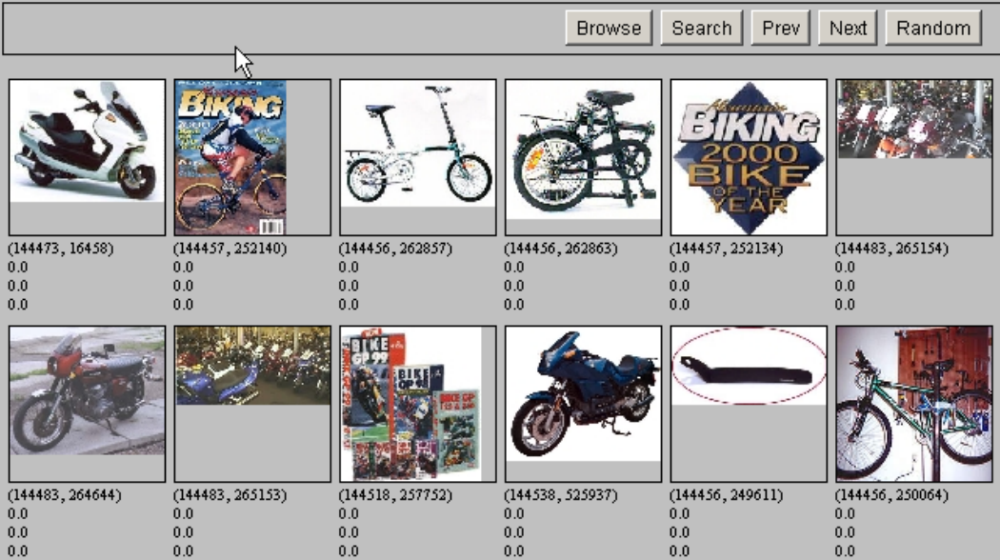
3. Vi trykker på resultatene vi anså som mest relevante:
   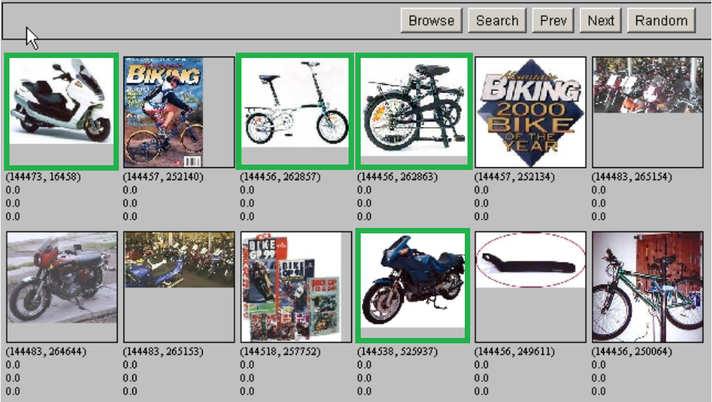
4. Søkemotoren gir oss nye, (forhåpentligvis) forbedrede resultater, basert på den opprinnelige spørringen, og informasjonen vi gir den:
   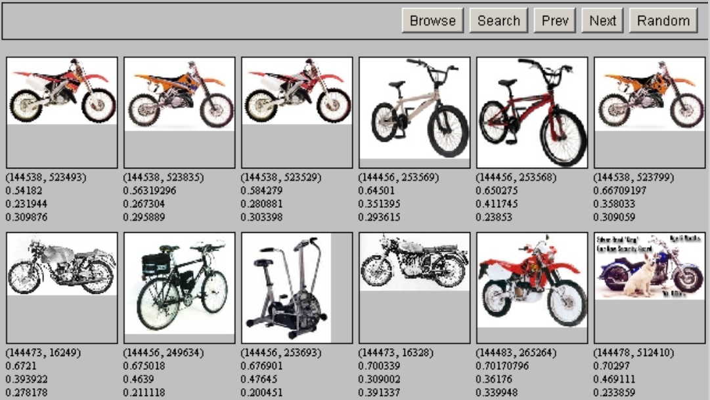

Dette eksemplet handler om bilder, men vi kan også gjøre noe tilsvarende for dokumenter, f.eks. Googles "similar pages"-funksjon.

### Gi resultater basert på resultater, istedenfor spørringen

Man skriver en spørring, og får noen resultater tilbake. Da kan man markere ett av dokumentene som "relevant", gjennom å trykke på "similar pages". Da får man opp flere dokumenter som ligner på dette:

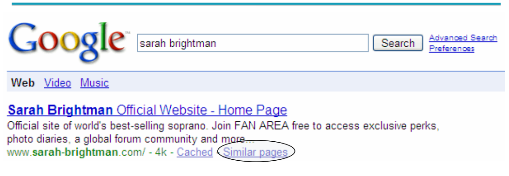

Vi kan ta dette enda et steg lengre! Si at spørringen vår er

> New space satellite applications

Da vil termene få en vekt, postinger bli scoret og ranket, også får vi de mest "relevante" dokumentene fra søkemotoren:

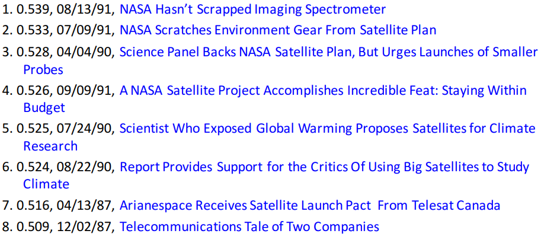

Fra disse kan vi _justere vekten_ på søketermene, gjennom å trykke på dokumentene som vi anser å være de mest er relevante:

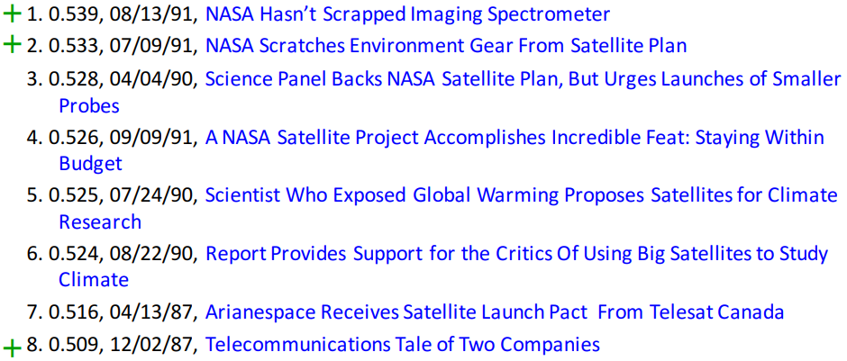

Og deretter få flere dokumenter som oppfyller behovet vårt, bedre enn det den opprinnelige spørringen gjorde!

### Velmente forslag

Noen ganger lar Google deg søke på de niche greiene dine, også heller hinte om at du kan få mange flere resultater om du justerer litt på det:

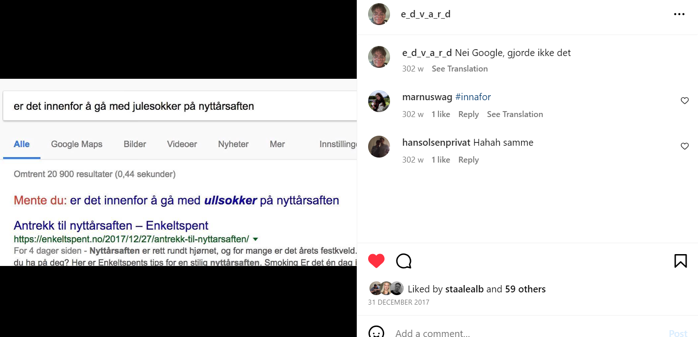

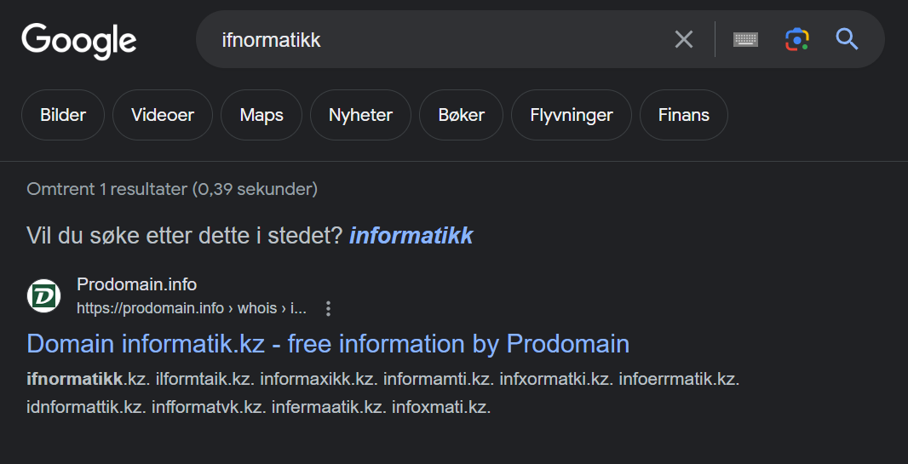

Men som oftest vil den ta en sjefsavgjørelse, og guilte deg til å søke på det du egentlig vil ha:


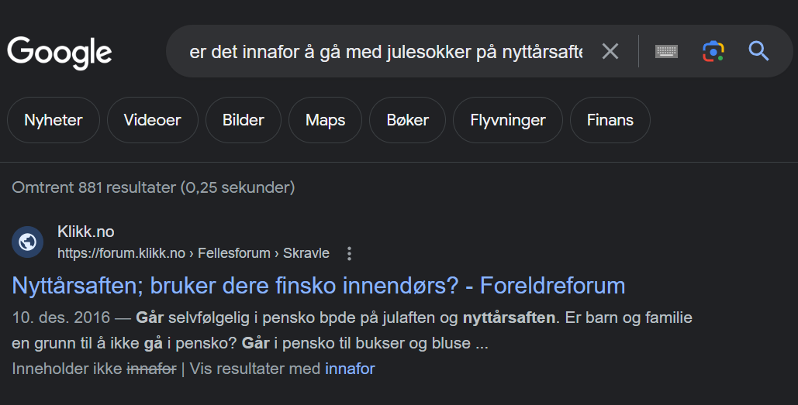

### Rocchio-algoritmen

Her er hovedkonseptet at dokumentene ligger i et vektor-rom, også beregner vi gjennomsnittet av vektene deres.

I forelesningen så vi den skumle Sentroide-formelen:

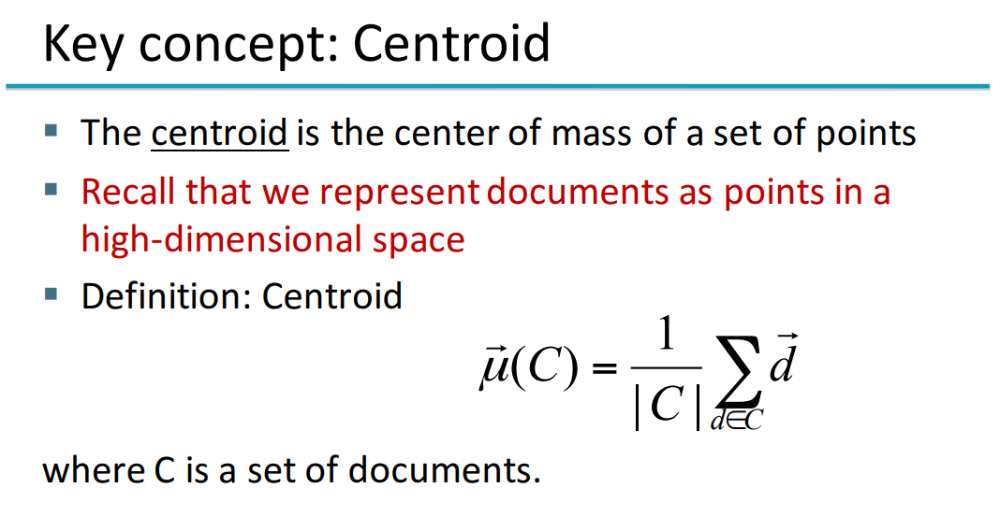

Den kan også forklares slik: **gjennomsnittet av vektorene** (summen av vektorene, delt på antall vektorer) :)

Det kan også visualiseres ca. slik:

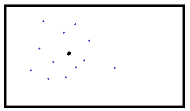

De blå prikkene er dokumenter, og den sorte prikken er sentroiden. Den ligger i "midten" av de blå prikkene :)

#### Men hvordan fungerer det i praksis?

I utgangspunktet vet vi ikke hvilke av dokumentene som er relevante eller irrelevante. Vi sender av gårde en spørring, som blir plassert et sted i vektor-rommet:

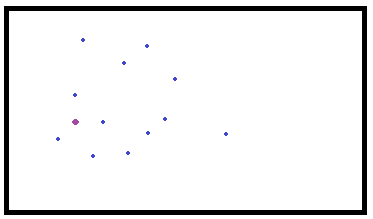

Den lilla flekken er spørringen vår, og dokumentene i nærheten er side 1 av Google. Vi kan tenke at dokumentet helt til høyre ligger på side 2-3, for eksempel.

Gjennom relevance feedback markerer vi noen dokumenter som relevante, f.eks. slik:

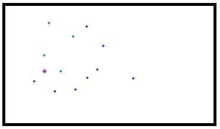

De grønne prikkene er "relevante" dokumenter. Da kan vi bruke denne, igjen, kjempeskumle, formelen:

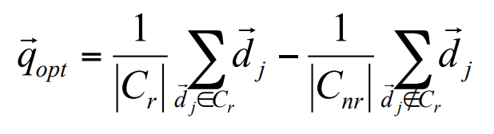

Den sier egentlig: Ta differansen av sentroiden av de relevante dokumentene R, og sentroiden av de irrelevante dokumentene NR, og bruk resultatet til å produsere en ny "spørring", istedenfor den brukeren opprinnelig ga oss:

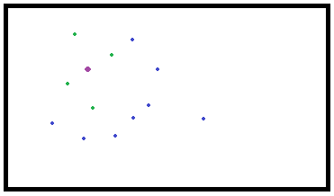

Formelen som brukes i praksis (fra 1971) jobber med litt flere variabler:

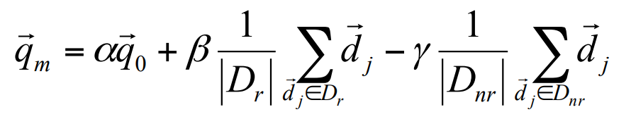

Med andre ord:

```python
refined_query =
      alpha * spørringen vår
    +  beta * sentroiden av relevante dokumenter
    + delta * sentroiden av irrelevante dokumenter
```

Alpha, beta og delta er variabler som brukes for å tweake den nye spørringen! Ofte er beta, variabelen som fokuserer på relevante dokumenter, den viktigste å øke. Noen søkemotorer har default delta=0, fordi det er såpass dyrt å ha med negative resultater.

### Problemer med relevance feedback

For at dette skal fungere i det hele tatt, er vi avhengige av nøyaktig to ting:

1. Brukeren _vet_ hva de er ute etter
   - Brudd: Stavefeil, feil ordforråd (kosmonaut/astronaut) osv.
2. Prototypene oppfører seg likt
   - Brudd: Relevante dokumenter har ulik distribusjon av termer, irrelevante dokumenter har lik distribusjon av termer som relevante dokumenter, etc.

En annen ting er at lange spørringer fungerer dårlig på standard søkemotorer, og det er "dyrt" for søkemotoren.

## Query expansion

Når vi jobber med relevance feedback, gir brukerne tilbakemelding på dokumentene, slik at vi kan vekte termene annerledes og søke etter nye dokumenter.

Når vi jobber med query expansion, hjelper vi brukerne med å finpusse spørringene deres _før_ vi gir dem resultater!

Et eksempel på dette er query assist: Google foreslår hva vi kan søke på (hva som vil gi oss mange resultater), basert på det vi allerede har skrevet:


En annen ting, som skjer "under the hood", er **thesaurus-based query expansion**, der søkemotoren erstatter søkeord med synonymer, eller legger til flere termer. For eksempel kan en spørring være

> Jaguar

men siden Google "vet" at vi ønsker å få bilder av katten, blir spørringen omgjort til

> Jaguar animal

før den blir sendt av gårde, slik at vi får mer relevante dokumenter. Derimot får vi jo mange færre relevante dokumenter hvis vi gjetter feil (om brukeren egentlig var keen på f.eks. `Jaguar car`)

#### Hvordan vet egentlig søkemotoren hvilke termer som er synonymer?

Dette kan gjøres gjennom "automatic thesaurus-generation", og følger fra to kriterier:

1. To ord er like om de ofte forekommer med de samme ordene
   - F.eks. "doctor" og "nurse" havner begge ofte sammen med ord som "hospital", "patient", "treatment" osv.
2. To ord er like hvis de har samme grammatiske relasjon til andre ord
   - F.eks. kan verbene "drive" og "ride" kan begge erstatte blank i "she is able to \_ a vehicle"

Problemet havner igjen da ordene ikke egentlig er like _nok_, og i verste fall totalt ulike. Det er kjedelig å søke etter

> Apple computer

også oppdage at søkemotoren har tatt en sjefsavgjørelse og heller funnet resultater på

> Red fruit computer

# Ukas bok

[Learn You a Haskell For Great Good](http://learnyouahaskell.com/)

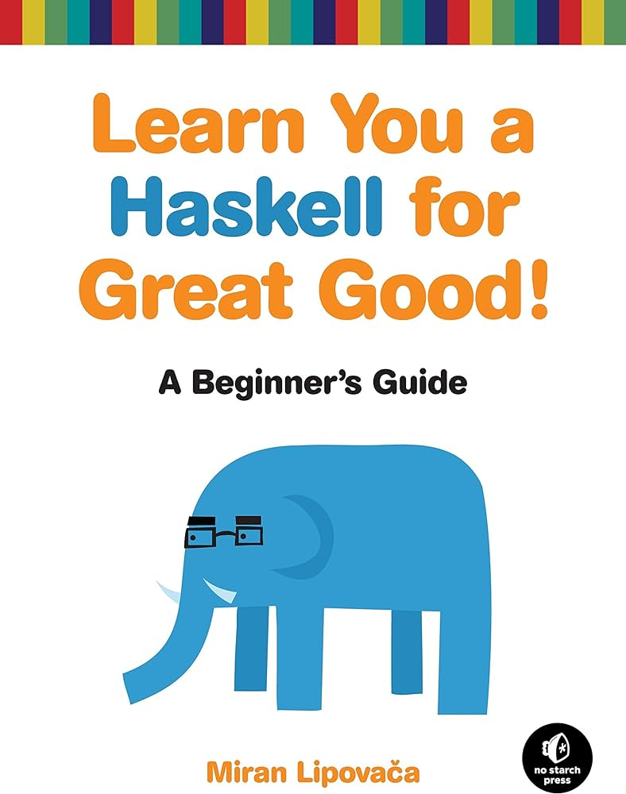
